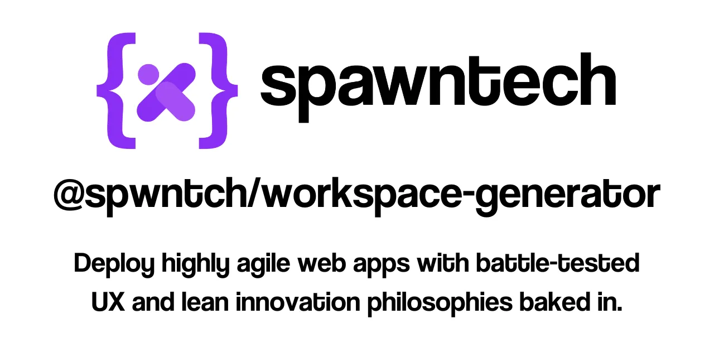

# @spwntch/workspace-generate



## tldr;

```bash
pnpm dlx spawn-workspace
```

## Intro

This workspace utilizes the powerful capabilities of Nx within a PNPM monorepo to provide specialized tools for generating and managing development environments seamlessly.

## Spawntech CLI

`spawn-workspace` is our primary command line interface (CLI) that makes setting up new software development workspaces quick and effortless. It utilizes our custom `workspace-generator` package to scaffold projects tailored to your needs.

### Getting Started

To create a new workspace, run:

```bash
pnpm run spawn-workspace
```

This will guide you through setting up a new development environment using our intuitive CLI. Spawned workspaces are created in your project folder and you can add as many as you like.

To spawn a workspace in a folder outside of this project, run:

```bash
pnpm dlx spawn-workspace
```

## Workspace Generator

Our `workspace-generator` is built on the robust `@nx/devkit` and Nx plugin generator frameworks. Its called internally by `spawn-workspace` when you execute the above commnds.It provides a powerful toolkit for custom workspace generation. This is where we control what goes into newly spawned workspaces.

### Usage

To test any any changes you make to the generator, we'd recommend running a verdaccio local registry so you can publish updates locally. Simply publish changes and then running `pnpm run spawn-workspace` will use local versions.

## Key Features

- **Feature 1**: Supports pnpm, yarn and npm
- **Feature 2**: Integrates all [nx monorepo benefits](https://nx.dev), which curated nx plugin to optimise your development workflow.
- **Feature 3**: Tailwind css integration throughout all generated apps and libs
- **Feature 4**: Comes complete with a series of nextjs libs built on spawntech's range of components libraries.
- **Feature 5**: includes a storybook implementation for all libraries.
- **Feature 6**: offers getting-started-docs to fastrack you in your use of spawntech's dev frameworks.
- **Feature 7**: offers various app boilerplates that you can modify to implement you own ideas.
- **Feature 8**: leverages spawntech's component libraries, which leverage radix-ui for accessibility and which have all been through umpteen rounds of ux assessment.

## Explore and Extend

- Add or customize generators as per project requirements.
- Change package names to create your own cli.

## Set Up Your CI

Optimize your continuous integration pipelines with caching and distributed task execution. For detailed guidance:

- [Nx Remote Caching](https://nx.dev/features/share-your-cache)
- [Distribute Task Execution with Nx Cloud](https://nx.dev/nx-cloud/features/distribute-task-execution)

## Community and Support

- [Visit us on Github](https://github.com/spwntch)
- [Join the Spawntech Community](https://github.com/orgs/spwntch/discussions)
- [Follow Spawntech on Linkedin](https://www.linkedin.com/company/spawntech-io)

## Documentation

All components produced by our team are documented in [The Spawntech Storybook](https://docs.spawntech.io/). If you're wanting to use the Spawntech framework to build your apps, this is a great place to get started.

<!-- For comprehensive documentation on how to use `spawn-workspace` and `workspace-generator`, as well as integration with Nx, visit [our documentation](documentation-link). -->

## Other Spawntech Repos

Make sure to checkout [@spwntch/spwn](https://github.com/spwntch/spwn), our primary monorepo.

---

Powered by [Nx](https://nx.dev), a Smart Monorepo approach for modern development.
