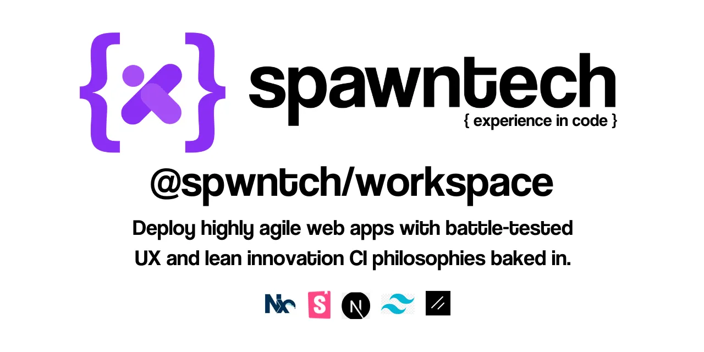

# @spwntch/workspace-generator



## tldr;

```bash
pnpm dlx spawn-workspace
```

## Intro

This workspace utilizes the powerful capabilities of [Nx](https://nx.dev) within a [PNPM monorepo](https://pnpm.io/workspaces) to provide specialized tools for generating and managing development environments seamlessly. You will find this repo useful if:

- You need to build quickly but don't want half-baked MVPs.
- You need to make sure your apps are usable out the gate and you want to leverage our countless UX tests.
- You want to get into fullstack apps using the latest and greatest react frameworks, but you don't want to worry about setting it all up.

Our goal is simple. We want to drive better ux in web apps and we want to enable you to embrace a lean mindset. Our workspace is a great place to start.

This repo is naturally opinionated, but we think we've really managed to include all the important tools you need to move fast and reliably.

## Spawntech CLI

`spawn-workspace` is our primary command line interface (CLI) that makes setting up new software development workspaces quick and effortless. It utilizes our custom `workspace-generator` package to scaffold projects tailored to your needs.

### Getting Started

To create a new workspace, run:

```bash
pnpm run spawn-workspace
```

This will guide you through setting up a new development environment using our intuitive CLI. Spawned workspaces are created in your project folder and you can add as many as you like.

To spawn a workspace in a folder outside of this project, run:

```bash
pnpm dlx spawn-workspace
```

## Workspace Generator

Our `workspace-generator` is built on the robust `@nx/devkit` and Nx plugin generator frameworks. Its called internally by `spawn-workspace` when you execute the above commnds.It provides a powerful toolkit for custom workspace generation. This is where we control what goes into newly spawned workspaces.

### Usage

To test any any changes you make to the generator, we'd recommend running a verdaccio local registry so you can publish updates locally. Simply publish changes and then running `pnpm run spawn-workspace` will use local versions.

## Key Features

- **Feature 1**: A clean codebase, first and foremost. Everyhting we do should be sustainable and maintainable.
- **Feature 2**: Supports pnpm, yarn and npm
- **Feature 3**: Integrates all [nx monorepo benefits](https://nx.dev), with curated nx plugins to optimise your development workflow.
- **Feature 4**: Tailwind css integration throughout all generated apps and libs.
- **Feature 5**: Comes complete with a series of nextjs libs built on Spawntech's range of components libraries.
- **Feature 6**: includes a storybook implementation for all generated component libraries. Your workspace will be a cynch to share with stakeholders.
- **Feature 7**: offers getting-started-docs to fast-rrack your use of Spawntech's dev frameworks.
- **Feature 8**: offers various app boilerplates that you can modify to implement you own ideas.
- **Feature 9**: leverages Spawntech's component libraries, which leverage radix-ui for accessibility and which have all been through umpteen rounds of ux assessment.
- **Feature 10**: And so the list goes on...

## Explore and Extend

- Add or customize generators as per project requirements.
- Change package names to create your own cli.

## Set Up Your CI

Optimize your continuous integration pipelines with caching and distributed task execution. For detailed guidance:

- [Nx Remote Caching](https://nx.dev/features/share-your-cache)
- [Distribute Task Execution with Nx Cloud](https://nx.dev/nx-cloud/features/distribute-task-execution)

## Community and Support

- [Visit us on Github](https://github.com/spwntch)
- [Join the Spawntech Community](https://github.com/orgs/spwntch/discussions)
- [Follow Spawntech on Linkedin](https://www.linkedin.com/company/Spawntech-io)

## Documentation

All components produced by our team are documented in [The Spawntech Storybook](https://docs.Spawntech.io/). If you're wanting to use the Spawntech framework to build your apps, this is a great place to get started.

<!-- For comprehensive documentation on how to use `spawn-workspace` and `workspace-generator`, as well as integration with Nx, visit [our documentation](documentation-link). -->

## Other Spawntech Repos

Make sure to checkout [@spwntch/spwn](https://github.com/spwntch/spwn), our primary monorepo.

---

Powered by [Nx](https://nx.dev), a Smart Monorepo approach for modern development.
